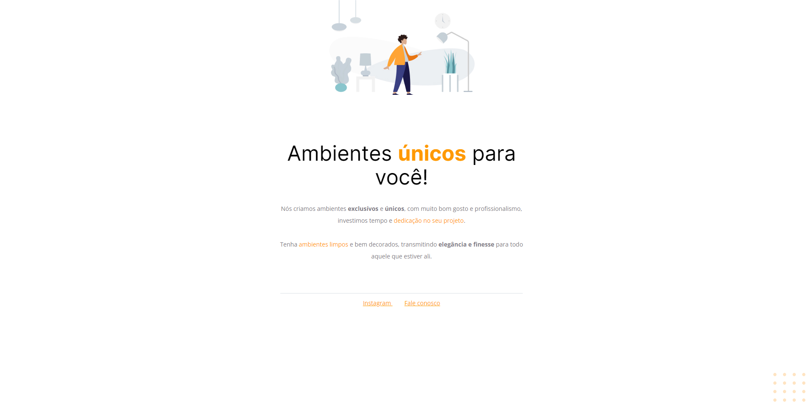

# Corrigindo bugs | Explorer Stage 2

### Essa tarefa faz parte do curso Explorer da [Rocketseat](https://www.rocketseat.com.br).

Nessa atividade foi corrigido alguns bugs do código, com foco na introdução ao CSS e alguns conceitos do mesmo.

As tecnologias utilizadas foram:

- HTML
- CSS

## 🔖 Layout 

Figma do projeto disponível nesse [Link](<https://www.figma.com/file/fAvYZz4dPV5MfhL77XkqkD/Explorer---Projeto-01?node-id=1%3A2&mode=dev>).